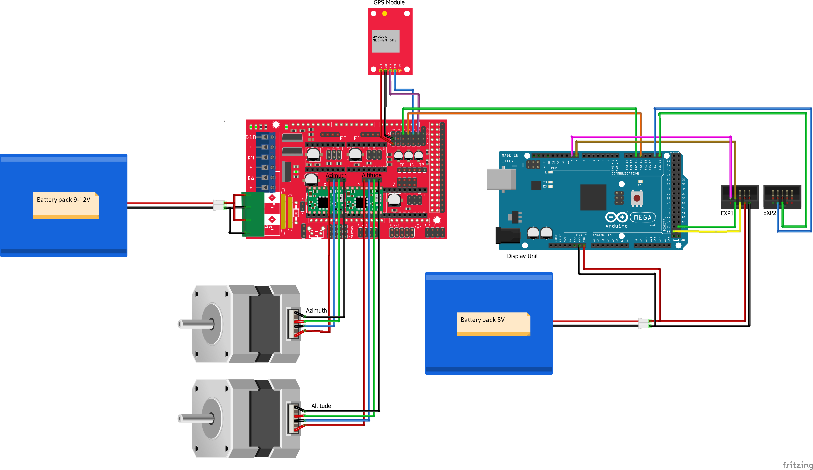

# dobson-star-tracker
This project aims to enable makers to motorize their dobson-style mounted telescopes using easily sourced hardware.

## Hardware

+ 2 Stepper Motors + drivers. I found that the size of my telescope (as pictured badly below) requires at least NEMA 17 with 1.2A current per phase. The altitude motor uses a (roughly) 5:1 gear ratio
+ Arduino with at least 6 Digital Pins. The instructions and example config work for an Arduino Mega with a RAMPS 1.4 shield
+ 3D printed motor mounts and gears
+ Optional: Two Buttons; Each requires one additional digital pin
+ Optional: A GPS module; Requires either a free TX/RX pin pair or two digital pins

## 3D Files

The printable files (stl and step format) can be found at: https://www.thingiverse.com/thing:3851307

## Installation

Setup should be pretty easy. Just open the dobson-star-tracker.ino file in the Arduino IDE, edit config.h to your liking. Then you just have to build and upload the sketch. Have a look at the DEBUG_* constants in config to get some output in the console. If the sketch builds and uploads, you can connect the telescope to Stellarium (guide incoming), or use the display unit (if you have one) to control the telescope.

## Wiring a RAMPS1.4

## Wiring with the Display Unit

My example uses a version of the well-known [RepRap Discount Full Graphics Smart Controller](https://reprap.org/wiki/RepRapDiscount_Full_Graphic_Smart_Controller). The only connection between the two Arduino boards is via the two cables connected to RX2 and TX2 on the Display Unit. For more information + code for the display unit head over to [currently preparing the repository].

## Serial Commands

+ :HLP# Print available Commands
+ Commands used by stellarium (you can use them as well)
  + :GR# Get Right Ascension
  + :GD# Get Declination
  + :Sr,HH:MM:SS# Set Right Ascension; Example: :Sr,12:34:56#
  + :Sd,[+/-]DD:MM:SS# Set Declination (DD is degrees) Example: :Sd,+12:34:56#
  + :MS# Start Move
  + :Q# Quit Move (Not Implemented)
+ Other commands
  + :TRK0# Disable tracking. This sets the telescopes isHomed member variable to false, so the motors stop moving
  + :TRK1# Enable tracking. The telescope will track whatever the target is
  + :STP0# Disable steppers permanently
  + :STP1# Enable steppers (after they were disabled using the STP0 command)
+ Debug commands
  + :DBGDSP# Send a status update to the display unit
  + :DBGDM[00-99]# Disable Motors for XX seconds
  + :DBGM[0-9]# Move to debug position X (see conversion.cpp; Later we will have a separate file with a star catalogue)
  + :DBGMIA# Increase Right Ascension by 1 degree
  + :DBGMDA# Decrease Right Ascension by 1 degree
  + :DBGMID# Increase Declination by 1 degree
  + :DBGMDD# Decrease Declination by 1 degree

## TODOs

The Most important TODOs are as follows (in no particular order)
+ Documentation
+ Board compatibility: Out-of-the-box support for Arduino Mega and Arduino Due with their respective RAMPS shields (Mostly done, Mega + RAMPS 1.4 and Due + modified RAMPS 1.4 work)
+ Time keeping: Handle big swings which could happen due to GPS issues
+ EEPROM: Store time and location in EEPROM (Mega) or Flash (Due); Provide a simple API for doing so
+ Motor control: Turn On/Off permanently. Off for X seconds is already implemented as :DBGDM[00-99]#
+ SD card support: Loading a star atlas from a sd card (preferrably connected to the display unit, but direct connection should be possible too)